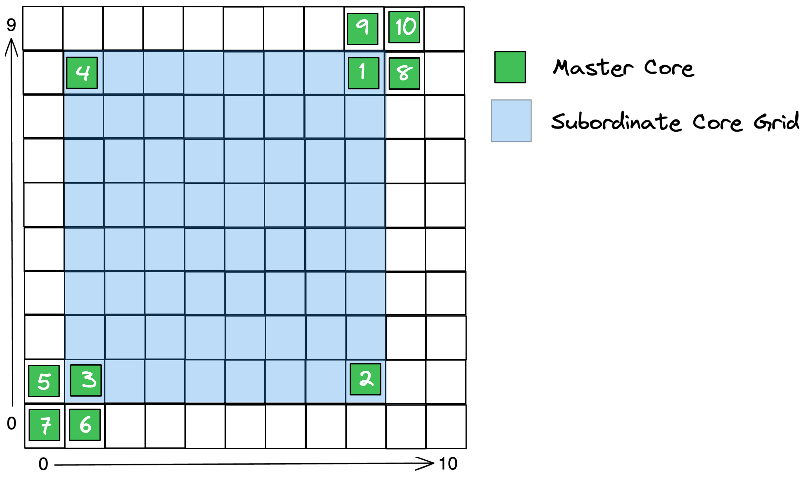
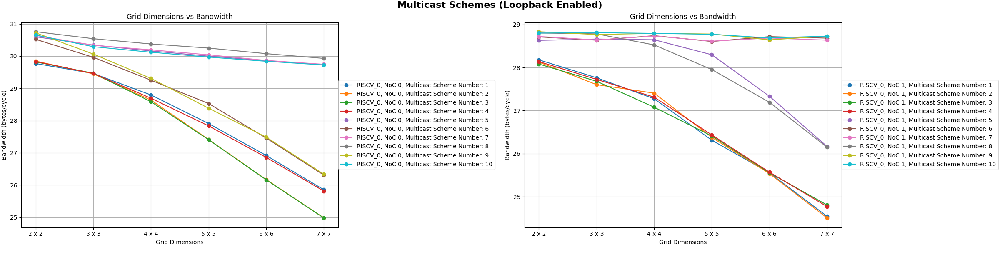

Multicast Schemes
=================

# Overview

The parameters used when performing a NoC multicast write operation can significantly affect performance (Bytes sent / cycle).

A set of tests that sweep through different values for these parameters have been performed and documented.

# Sweep Parameters

**Multicast Write Uses Loopback:**
- Yes, No

**NoC:**
- 0, 1

**Grid Dimensions (m x m):**
- WH: 2 to 7
- BH: 2 to 9

**Schemes:**

| Sender Inside Grid (1 - 4)        | Sender Outside Grid, Bottom Left Corner (5 - 7)   | Sender Outside Grid, Top Right Corner (8 - 10) |
|-----------------------------------|---------------------------------------------------|------------------------------------------------|
| 1: Top-Right Corner               | 5: Shared Column with Grid                        | 8: Shared Column with Grid                     |
| 2: Bottom-Right Corner            | 6: Shared Row with Grid                           | 9: Shared Row with Grid                        |
| 3: Bottom-Left Corner             | 7: Neither Column nor Row Shared with Grid        | 10: Neither Column nor Row Shared with Grid    |
| 4: Top-Left Corner                |                                                   |                                                |

# Results

## Plots

### WORMHOLE

### BLACKHOLE

## Key Observations

- A **noticeable drop in performance** is observed when the sender is:
    - Inside the grid (1 - 4)
    - Outside the grid and
        - NoC 0: Shares a row with the grid (6, 9)
        - NoC 1: Shares a row with the grid (5, 8)
- For the **inside-the-grid cases** (1 - 4), **performance increases slightly** when the multicast writes are performed **without loopback**

## Additional Notes

- The cause for the performance drop that occurs for when the sender is inside the grid (1 - 4) and when the sender is outside the grid and shares a row with the grid (6, 9 for NoC 0 and 5, 8 for NoC 1) is being investigated.
